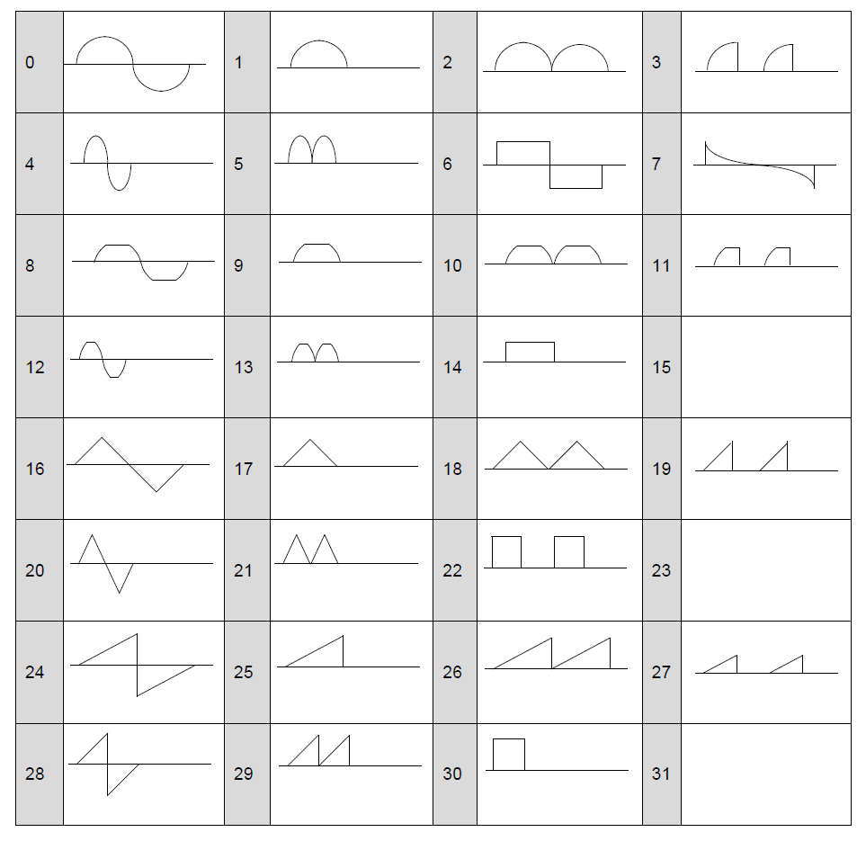

## Tone Parameter

### BO

|T_ADR|Name|D7|D6|D5|D4|D3|D2|D1|D0|
|-|-|-|-|-|-|-|-|-|-|
|#0+30x[vn]|BO|"0"|"0"|"0"|"0"|"0"|"0"|BO1|BO0|

#### Description
BO means Basic Octave. BO controls an octave setting.

+ BO=0 : 2^1
+ BO=1 : 2^0
+ BO=2 : 2^-1
+ BO=3 : 2^-2

### LFO, ALG

|T_ADR|Name|D7|D6|D5|D4|D3|D2|D1|D0|
|-|-|-|-|-|-|-|-|-|-|
|#1+30x[vn]|LFO,ALG|LFO1|LFO0|"0"|"0"|"0"|ALG2|ALG1|ALG0|

#### Description

LFO means a frequency of low frequency oscillator.

+ LFO=0 : 1.8Hz
+ LFO=1 : 4.0Hz
+ LFO=2 : 5.9Hz
+ LFO=3 : 7.0Hz

ALG means FM Algorithm. 8 algorithms can be selected.

### SR, XOF, KSR

|T_ADR|Name|D7|D6|D5|D4|D3|D2|D1|D0|
|-|-|-|-|-|-|-|-|-|-|
|#2+30x[vn]+7x[op]|SR, XOF, KSR|SR3|SR2|SR1|SR0|XOF|"0"|"0"|KSR|

#### Description

SR controls sustain rate of each operator.
if SR is set to 0, sound level is retained.  
XOF controls ignoring keyoff.
Evenif keyoff is set, any changes will not happen.  
KSR means key scale sensitivity for AEG rate. if KSR bit is on, high F-num EG rate changes faster.

### RR, DR

|T_ADR|Name|D7|D6|D5|D4|D3|D2|D1|D0|
|-|-|-|-|-|-|-|-|-|-|
|#3+30x[vn]+7x[op]|RR,DR|RR3|RR2|RR1|RR0|DR3|DR2|DR1|DR0|

#### Description

RR controls release rate of each operator.  
DR controls decay rate of each operator.  

### AR, SL

|T_ADR|Name|D7|D6|D5|D4|D3|D2|D1|D0|
|-|-|-|-|-|-|-|-|-|-|
|#4+30x[vn]+7x[op]|AR,SL|AR3|AR2|AR1|AR0|SL3|SL2|SL1|SL0|

#### Description

AR controls attack rate of each operator.  
SL controls sustain level of each operator. Sustain Level is the level just after decay rate.

### TL, KSL

|T_ADR|Name|D7|D6|D5|D4|D3|D2|D1|D0|
|-|-|-|-|-|-|-|-|-|-|
|#5+30x[vn]+7x[op]|TL,KSL|TL5|TL4|TL3|TL2|TL1|TL0|KSL1|KSL0|

#### Description
TL means total level.TL controls operator level.  

KSL means key scaling level sensitivity.In natural instruments, the volume attenuates as the pitch increases.KSL simulates this phenomenon.
+ KSL=0 : 0
+ KSL=1 : 3dB/oct
+ KSR=2 : 1.5dB/oct
+ KSR=3 : 6.0dB/oct

### DAM, EAM, DVB, EVB

|T_ADR|Name|D7|D6|D5|D4|D3|D2|D1|D0|
|-|-|-|-|-|-|-|-|-|-|
|#6+30x[vn]+7x[op]|DAM,EAM,DVB,EVB|"0"|DAM1|DAM0|EAM|"0"|DVB1|DVB0|EVB|

#### Description

EAM means enable amplitude modulation.EAM set amplitude modulation.   
DAM means amplitude modulation depth.  
+ DAM=0 : 1.3dB
+ DAM=1 : 2.8dB
+ DAM=2 : 5.8dB
+ DAM=3 : 11.8dB

EVB means enable vibrato.EVB set vibrato.  
DVB means vibrato depth.
+ DVB=0 : 3.4cent
+ DVB=1 : 6.7cent
+ DVB=2 : 13.5cent
+ DVB=3 : 26.8cent

### MULTI, DT

|T_ADR|Name|D7|D6|D5|D4|D3|D2|D1|D0|
|-|-|-|-|-|-|-|-|-|-|
|#7+30x[vn]+7x[op]|MULTI, DT|MULTI3|MULTI2|MULTI1|MULTI0|"0"|DT2|DT1|DT0|

#### Description
MULTI controls magnification of frequency.  

|MULTI|0|1|2|3|4|5|6|7|8|9|10,11|12,13|14,15|
|-|-|-|-|-|-|-|-|-|-|-|-|-|
|magnification|1/2|1|2|3|4|5|6|7|8|9|10|12|15|

DT means detune.

### WS, FB

|T_ADR|Name|D7|D6|D5|D4|D3|D2|D1|D0|
|-|-|-|-|-|-|-|-|-|-|
|#8+30x[vn]+7x[op]|WS,FB|WS5|WS3|WS2|WS1|WS0|FB2|FB1|FB0|

#### Description
WS means wave shape each operator generates.
29 wave shapes can be selected.  

FB means FM feedback level.
+ FB=0 : 0
+ FB=1 : pi/16
+ FB=2 : pi/8
+ FB=3 : pi/4
+ FB=4 : pi/2
+ FB=5 : pi
+ FB=6 : 2pi
+ FB=7 : 4pi

